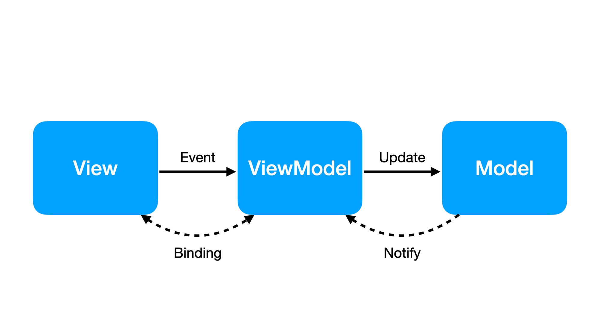

# EYE-Mate

<p align="center">

</p>

### 🗂️ 목차
1. [앱 소개](#앱-소개)
2. [개발 환경](#개발-환경)
   - [프로젝트 아키텍처](#프로젝트-아키텍처)
   - [사용한 기술](#사용한-기술)
   - [사용한 라이브러리](#사용한-라이브러리)
3. [프로젝트 파일 구조](#프로젝트-파일-구조)
4. [팀원 소개](#팀원-소개)

</br>

## 📝 앱 소개

### 내 눈을 지켜주는 친구, EYE-Mate

> **EYE-Mate는 눈 건강 관리 및 커뮤니티 플랫폼입니다.**</br></br>
>
> ❓현대인들의 눈에 대한 피로도는 갈수록 상승하고 있습니다!</br></br>
> 저희 EYE-Mate는 사용자들의 지속적인 눈 건강 로드맵을 통해 현대 사람들의 눈 건강 관리에 도움을 줄 수 있으며</br>
> 내일의 하늘이 오늘의 하늘 만큼 밝기를 목표로 하고있습니다.

</br>

### 👀 주요 기능
- 거리 측정으로 시력, 색각, 난시, 시야 총 4가지 검사를 수행
- Lottie를 활용해 눈 운동 기능 제공하여 눈 건강 개선
- 사용자의 눈 상태를 기록하고 관리하는 개인 메뉴 제공
- 눈 건강과 관련된 정보 공유 및 소통을 위한 커뮤니티 제공
- 내 주변 안경원 및 안과 정보 제공

</br>

## 🌐 개발 환경

 
  
```markdown
XCode: 15.2
Swift: 5.9.2
iOS: 16.0
```

## 💻 프로젝트 기술

### 프로젝트 아키텍처

<div align="center">
  
| MVVM |  
|:----------:|
|  |  

</div>

### 사용한 기술
<hr>
<details>
  <summary>SwiftUI</summary>

- 선언형, 자동화, 조합, 데이터 업데이트 및 최신화 4가지 원칙을 기반으로 설계되어 어디서든 더 적은 코드, 더 좋은 코드를 작성 가능
</details>

<details>
  <summary>UIKit</summary>

- ARKit, NaverMap, Lottie를 사용하는데에 있어서 호환성을 제공하기 위해 UIKit이 사용되었음
- UIKit을 활용하여 선언적 UI 프레임워크인 SwiftUI에서 사용할 수 없는 코드나 기능을 구현하거나 기존에 개발된 UIKit 코드와 통합
- 이를 통해 SwiftUI로 개발하면서도 UIKit의 강력한 기능과 생태계를 활용할 수 있었음
</details>

<details>
  <summary>ARKit</summary>
  
  - iOS 애플리케이션에서 증강 현실(AR)을 구현하기 위한 기술.
  - 사용자의 전면 카메라를 통해 사용자 얼굴까지의 거리를 측정하여 안구 관련 검사의 정확도를 높이는 데 사용
  - 사용자의 왼쪽 눈, 오른쪽 눈의 변환 행렬을 얻어 이를 기반으로 눈까지의 거리를 계산
</details>

<details>
  <summary>WebKit</summary>
  
  - Apple이 개발한 웹 렌더링 엔진으로, 앱 내에서 웹 콘텐츠를 표시하고 관리하는 데 사용
  - 사용자가 눈 관련 상식을 편리하게 읽고 학습할 수 있도록 눈 관련 상식 기사 등을 로드하여 사용자에게 제공
  - 눈 관련 상식 기사에는 시각적인 콘텐츠와 함께 제공되어 사용자의 이해를 돕고 흥미를 유발함
</details>

<details>
  <summary>PhotosUI</summary>
  
  - 사용자의 사진 라이브러리에 액세스하여 ImagePicker 기능 수행을 위한 라이브러리
  - 프로필 이미지 또는 게시물에 첨부할 이미지 선택
</details>

<details>
  <summary>Charts</summary>
  
  - SwiftUI에서 그래프와 차트를 생성하고 표시하기 위한 라이브러리
  - 데이터를 시각적으로 표현하여 눈 건강에 대한 추세를 쉽게 이해할 수 있고 변동을 한눈에 파악할 수 있어 분석과 판단을 용이하게 하며 더욱 흥미롭고 유익하게 만들 수 있음
  - 사용자 시력 변화에 대한 추세를 차트로 표현하여 변화에 대한 추세를 더욱 흥미롭고 쉽게 파악 가능
</details>

<details>
  <summary>CoreLocation</summary>
  
  - 애플리케이션에서 위치 기반 서비스를 활용하기 위한 기능을 제공하는 프레임워크
  - 사용자의 현재 위치 정보를 가져오고, 지리적인 위치 정보를 사용하여 애플레케이션에서 위치 기반 서비스를 제공하는데 사용됨
  - 내 주변 탭, 눈 검사 결과 화면에서 사용자 주변의 안과, 안경점 정보를 제공하기 위해 현재 사용자 위치를 파악하는데 사용
</details>

### 사용한 라이브러리
<hr>
<details>
  <summary>AcknowList</summary>

- 앱에서 사용된 오픈 소스 라이브러리나 이미지 등의 자산에 대한 정보를 앱의 설정 또는 정보 섹션에 표시하기 위해 사용한 라이브러리
- 오픈소스 라이선스 기능 구현
</details>
<details>
  <summary>FirebaseCore</summary>

- Firebase Authentication, Firebase Firestore, Firebase Storage, Firebase Cloud Messaging과 같은 Firebase 서비스 모듈을 사용하기 위한 라이브러리
</details>
<details>
  <summary>FirebaseAuth</summary>

- 사용자 인증을 구현하기 위해 사용한 라이브러리
- 회원가입 및 로그인 기능 구현
</details>
<details>
  <summary>FirebaseFirestore</summary>

- 실시간 데이터를 저장, 동기화 및 쿼리하기 위해 사용한 라이브러리
- 사용자의 데이터 관리
</details>
<details>
  <summary>FirebaseStorage</summary>

- 사용자가 업로드한 파일을 안전하게 저장하고 관리하기 위해 사용한 라이브러리
- 프로필 이미지와 게시물 이미지 관리
</details>
<details>
  <summary>FirebaseMessaging</summary>

- 사용자에게 푸시 알림을 전송하기 위해 사용한 라이브러리
- 푸시 알림 기능 구현
</details>
<details>
  <summary>Kingfisher</summary>

- 이미지 다운로드 및 캐싱을 담당하는 라이브러리
- 이미지 관련 작업을 간편하게 처리하고 성능 최적화
</details>
<details>
  <summary>lottie-ios</summary>

- 앱에 애니메이션을 추가하기 위해 사용한 라이브러리
- 눈 운동 기능 구현
</details>
<details>
  <summary>NMapsMap</summary>

- 지도를 표시하고 사용자 위치를 표시하거나 추적, 마커를 추가하고 사용자 인터랙션을 처리하기 위한 라이브러리
- 내 주변 안과 및 안경원 기능 구현
</details>
<details>
  <summary>SlackKit</summary>

- Slack 워크스페이스로 메시지를 보내기 위해 사용한 라이브러리
- 고객센터, 게시판 신고 기능 구현
</details>

## 📂 프로젝트 파일 구조

<details>
  <summary>파일 트리</summary>
  
```markdown
📦EYE-Mate
 ┣ 📂Core
 ┃ ┣ 📜AppDelegate.swift
 ┃ ┣ 📜EYE_MateApp.swift
 ┃ ┗ 📜NotificationManager.swift
 ┣ 📂Extensions
 ┃ ┣ 📜Bundle+.swift
 ┃ ┣ 📜Color+.swift
 ┃ ┣ 📜Font+.swift
 ┃ ┣ 📜Image+.swift
 ┃ ┣ 📜String+.swift
 ┃ ┣ 📜UINavigationController+.swift
 ┃ ┗ 📜View+.swift
 ┣ 📂Models
 ┃ ┣ 📜CPData.swift
 ┃ ┣ 📜CountryNumbers.json
 ┃ ┣ 📜FAQ.swift
 ┃ ┣ 📜Places.swift
 ┃ ┣ 📜Post.swift
 ┃ ┣ 📜Router.swift
 ┃ ┣ 📜SettingModels.swift
 ┃ ┣ 📜TestModel.swift
 ┃ ┣ 📜User.swift
 ┣ 📂Resources
 ┃ ┣ 📂Fonts
 ┃ ┗ 📂Lottie
 ┣ 📂Views
 ┃ ┣ 📂Community
 ┃ ┃ ┣ 📂FAQ
 ┃ ┃ ┃ ┣ 📜FAQRowCellView.swift
 ┃ ┃ ┃ ┣ 📜FAQView.swift
 ┃ ┃ ┃ ┗ 📜FAQViewModel.swift
 ┃ ┃ ┣ 📂FreeBoard
 ┃ ┃ ┃ ┣ 📂CreateNewPost
 ┃ ┃ ┃ ┃ ┣ 📜CreateNewPostView.swift
 ┃ ┃ ┃ ┃ ┣ 📜CreateNewPostViewModel.swift
 ┃ ┃ ┃ ┃ ┣ 📜ImagePickerView.swift
 ┃ ┃ ┃ ┃ ┗ 📜NewPostView.swift
 ┃ ┃ ┃ ┣ 📂Post
 ┃ ┃ ┃ ┃ ┣ 📜CommentRowCellView.swift
 ┃ ┃ ┃ ┃ ┣ 📜CommentView.swift
 ┃ ┃ ┃ ┃ ┣ 📜CommentViewModel.swift
 ┃ ┃ ┃ ┃ ┣ 📜ExpandImageView.swift
 ┃ ┃ ┃ ┃ ┣ 📜ImageCardView.swift
 ┃ ┃ ┃ ┃ ┣ 📜PostContent.swift
 ┃ ┃ ┃ ┃ ┣ 📜PostView.swift
 ┃ ┃ ┃ ┃ ┣ 📜PostViewModel.swift
 ┃ ┃ ┃ ┃ ┗ 📜ReplyCommentRowCellView.swift
 ┃ ┃ ┃ ┣ 📜CommunitySearchBar.swift
 ┃ ┃ ┃ ┣ 📜FreeBoardView.swift
 ┃ ┃ ┃ ┣ 📜FreeBoardViewModel.swift
 ┃ ┃ ┃ ┣ 📜PostCardView.swift
 ┃ ┃ ┃ ┗ 📜ReusablePostsView.swift
 ┃ ┃ ┗ 📜CommunityView.swift
 ┃ ┣ 📂EyeMap
 ┃ ┃ ┣ 📜ActionAreaView.swift
 ┃ ┃ ┣ 📜AsyncImageView.swift
 ┃ ┃ ┣ 📜EyeMapView.swift
 ┃ ┃ ┣ 📜InfoView.swift
 ┃ ┃ ┣ 📜MapButtonStyle.swift
 ┃ ┃ ┣ 📜MapImageModifier.swift
 ┃ ┃ ┣ 📜MapModalView.swift
 ┃ ┃ ┣ 📜MapTabBarView.swift
 ┃ ┃ ┣ 📜MapView.swift
 ┃ ┃ ┗ 📜MapViewModel.swift
 ┃ ┣ 📂Home
 ┃ ┃ ┣ 📂EyeSense
 ┃ ┃ ┃ ┣ 📜EyeSenseOnBoardingViewModel.swift
 ┃ ┃ ┃ ┣ 📜EyeSenseOnboardingView.swift
 ┃ ┃ ┃ ┣ 📜EyeSenseView.swift
 ┃ ┃ ┃ ┣ 📜OffsetKey.swift
 ┃ ┃ ┃ ┗ 📜PageControl.swift
 ┃ ┃ ┣ 📂Menu
 ┃ ┃ ┃ ┣ 📜HomeViewCellView.swift
 ┃ ┃ ┃ ┗ 📜MenuModel.swift
 ┃ ┃ ┣ 📂Record
 ┃ ┃ ┃ ┣ 📂AddRecord
 ┃ ┃ ┃ ┃ ┣ 📜AddRecordHeader.swift
 ┃ ┃ ┃ ┃ ┣ 📜AddRecordSubtitleView.swift
 ┃ ┃ ┃ ┃ ┣ 📜AddRecordView.swift
 ┃ ┃ ┃ ┃ ┣ 📜CheckBoxButton.swift
 ┃ ┃ ┃ ┃ ┣ 📜CustomMenu.swift
 ┃ ┃ ┃ ┃ ┣ 📜CustomMenuButton.swift
 ┃ ┃ ┃ ┃ ┣ 📜CustomSlider.swift
 ┃ ┃ ┃ ┃ ┣ 📜EyeStatusButtonGroup.swift
 ┃ ┃ ┃ ┃ ┣ 📜EyewareButtonGroup.swift
 ┃ ┃ ┃ ┃ ┣ 📜PlaceButtonGroup.swift
 ┃ ┃ ┃ ┃ ┣ 📜RadioButton.swift
 ┃ ┃ ┃ ┃ ┣ 📜SurgeryButtonGroup.swift
 ┃ ┃ ┃ ┃ ┣ 📜TestTypeButtonGroup.swift
 ┃ ┃ ┃ ┃ ┗ 📜VisionSlider.swift
 ┃ ┃ ┃ ┣ 📂AllRecord
 ┃ ┃ ┃ ┃ ┣ 📜AllRecordHeader.swift
 ┃ ┃ ┃ ┃ ┗ 📜AllRecordView.swift
 ┃ ┃ ┃ ┣ 📜ColoredText.swift
 ┃ ┃ ┃ ┣ 📜EmptyVisionChart.swift
 ┃ ┃ ┃ ┣ 📜RecordBox.swift
 ┃ ┃ ┃ ┣ 📜RecordView.swift
 ┃ ┃ ┃ ┣ 📜RecordViewModel.swift
 ┃ ┃ ┃ ┗ 📜VisionChart.swift
 ┃ ┃ ┣ 📂TestViews
 ┃ ┃ ┃ ┣ 📂Astigmatism
 ┃ ┃ ┃ ┃ ┣ 📜AstigmatismTestView.swift
 ┃ ┃ ┃ ┃ ┣ 📜AstigmatismTestViewModel.swift
 ┃ ┃ ┃ ┃ ┣ 📜AstigmatismView.swift
 ┃ ┃ ┃ ┃ ┗ 📜AstigmatismViewModel.swift
 ┃ ┃ ┃ ┣ 📂Color
 ┃ ┃ ┃ ┃ ┣ 📜ColorTestView.swift
 ┃ ┃ ┃ ┃ ┣ 📜ColorTestViewModel.swift
 ┃ ┃ ┃ ┃ ┣ 📜ColorView.swift
 ┃ ┃ ┃ ┃ ┗ 📜ColorViewModel.swift
 ┃ ┃ ┃ ┣ 📂Common
 ┃ ┃ ┃ ┃ ┣ 📜BackgroundView.swift
 ┃ ┃ ┃ ┃ ┣ 📜ExplanationTextView.swift
 ┃ ┃ ┃ ┃ ┣ 📜PlaceCellView.swift
 ┃ ┃ ┃ ┃ ┣ 📜TestAlertView.swift
 ┃ ┃ ┃ ┃ ┣ 📜TestOnboardingView.swift
 ┃ ┃ ┃ ┃ ┣ 📜TestResultTitleView.swift
 ┃ ┃ ┃ ┃ ┣ 📜TestType.swift
 ┃ ┃ ┃ ┃ ┗ 📜WarningText.swift
 ┃ ┃ ┃ ┣ 📂Distance
 ┃ ┃ ┃ ┃ ┣ 📜DistanceConditionView.swift
 ┃ ┃ ┃ ┃ ┣ 📜DistanceConditionViewModel.swift
 ┃ ┃ ┃ ┃ ┗ 📜DistanceFaceAndDevice.swift
 ┃ ┃ ┃ ┣ 📂Sight
 ┃ ┃ ┃ ┃ ┣ 📜SightTestView.swift
 ┃ ┃ ┃ ┃ ┣ 📜SightTestViewModel.swift
 ┃ ┃ ┃ ┃ ┣ 📜SightView.swift
 ┃ ┃ ┃ ┃ ┗ 📜SightViewModel.swift
 ┃ ┃ ┃ ┗ 📂Vision
 ┃ ┃ ┃ ┃ ┣ 📜VisionTestView.swift
 ┃ ┃ ┃ ┃ ┣ 📜VisionTestViewModel.swift
 ┃ ┃ ┃ ┃ ┣ 📜VisionView.swift
 ┃ ┃ ┃ ┃ ┗ 📜VisionViewModel.swift
 ┃ ┃ ┣ 📜HomeView.swift
 ┃ ┃ ┗ 📜HomeViewModel.swift
 ┃ ┣ 📂Login
 ┃ ┃ ┣ 📜LoginView.swift
 ┃ ┃ ┣ 📜LoginViewModel.swift
 ┃ ┃ ┣ 📜OTPVerificationView.swift
 ┃ ┃ ┣ 📜PhoneNumberView.swift
 ┃ ┃ ┣ 📜SignInView.swift
 ┃ ┃ ┣ 📜SignUpProfileView.swift
 ┃ ┃ ┗ 📜SignUpView.swift
 ┃ ┣ 📂Movement
 ┃ ┃ ┣ 📂MovementLottie
 ┃ ┃ ┃ ┗ 📜MovementLottieView.swift
 ┃ ┃ ┣ 📂Toast
 ┃ ┃ ┃ ┣ 📜Toast.swift
 ┃ ┃ ┃ ┣ 📜ToastModifier.swift
 ┃ ┃ ┃ ┗ 📜ToastView.swift
 ┃ ┃ ┣ 📜HorizontalDivider.swift
 ┃ ┃ ┣ 📜MovementView.swift
 ┃ ┃ ┣ 📜MovementViewModel.swift
 ┃ ┃ ┗ 📜StartMovementRow.swift
 ┃ ┣ 📂Profile
 ┃ ┃ ┣ 📜EditableProfileView.swift
 ┃ ┃ ┣ 📜ProfileNameTextField.swift
 ┃ ┃ ┣ 📜ProfileView.swift
 ┃ ┃ ┗ 📜ProfileViewModel.swift
 ┃ ┣ 📂Setting
 ┃ ┃ ┣ 📂Account
 ┃ ┃ ┃ ┣ 📜AccountDeleteView.swift
 ┃ ┃ ┃ ┣ 📜AccountDeleteViewModel.swift
 ┃ ┃ ┃ ┗ 📜DeleteAlertView.swift
 ┃ ┃ ┣ 📂AppManage
 ┃ ┃ ┃ ┣ 📜CSViewModel.swift
 ┃ ┃ ┃ ┣ 📜CustomerServiceView.swift
 ┃ ┃ ┃ ┗ 📜LicenseView.swift
 ┃ ┃ ┣ 📂Profile
 ┃ ┃ ┃ ┣ 📜ChangeUserNameView.swift
 ┃ ┃ ┃ ┣ 📜ImageActionSheetView.swift
 ┃ ┃ ┃ ┗ 📜ProfileListView.swift
 ┃ ┃ ┣ 📜MyPostsView.swift
 ┃ ┃ ┣ 📜ScrapPostsView.swift
 ┃ ┃ ┣ 📜SettingListDivider.swift
 ┃ ┃ ┣ 📜SettingListView.swift
 ┃ ┃ ┣ 📜SettingNavigationTitle.swift
 ┃ ┃ ┣ 📜SettingTitleModifier.swift
 ┃ ┃ ┗ 📜SettingView.swift
 ┃ ┣ 📂Styles
 ┃ ┃ ┣ 📜CustomAlertView.swift
 ┃ ┃ ┣ 📜CustomBackButton.swift
 ┃ ┃ ┣ 📜CustomButton.swift
 ┃ ┃ ┣ 📜CustomNavigationTitle.swift
 ┃ ┃ ┣ 📜CustomTabBar.swift
 ┃ ┃ ┣ 📜CustomTabPage.swift
 ┃ ┃ ┣ 📜HapticManager.swift
 ┃ ┃ ┗ 📜TabBarItem.swift
 ┃ ┣ 📜LoadingView.swift
 ┃ ┣ 📜MainView.swift
 ┃ ┗ 📜WrappingHStack.swift 
 ┃
 ┣ 📜APIKEY.plist
 ┣ 📜EYE-Mate.entitlements
 ┣ 📜GoogleService-Info.plist
 ┣ 📜Info.plist
 ┗ 📜Pods-EYE-Mate-acknowledgements.plist
```
</details>

## 👨‍💻 팀원 소개

|                               |                               |                               |                               |
| :--------------------------------------------------------------------------------------------------------------------------------------------: | :--------------------------------------------------------------------------------------------------------------------------------------------: | :--------------------------------------------------------------------------------------------------------------------------------------------: | :--------------------------------------------------------------------------------------------------------------------------------------------: |
|                                                      [오성준](https://github.com/sunujun)                                                      |                                                      [이민영](https://github.com/Mminy62)                                                      |                                                      [이성현](https://github.com/zxl3651)                                                      |                                                      [하태준](https://github.com/htj7425)                                                      |
| <a href="https://github.com/sunujun"></a> | <a href="https://github.com/Mminy62"></a> | <a href="https://github.com/zxl3651"></a> | <a href="https://github.com/htj7425"></a> |
